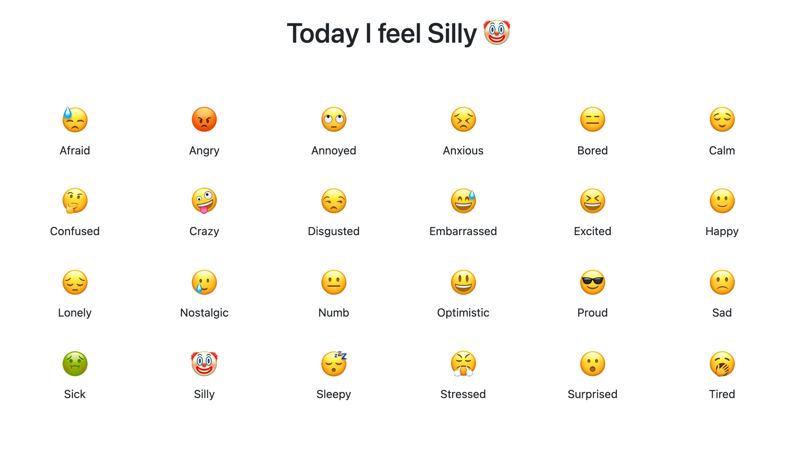

# 🚧 Emoji Tracker

## Description

Emoji mood tracking application currently in development. The app will feature a set of emojis for the user to quickly choose how they're feeling at the moment. The user will then be have access to a GUI with their data.

## Table of Contents

- [Image](#image)
- [Technologies](#technologies)
- [Known-Bugs](#known-bugs)
- [Next-Steps](#next-steps)
- [License](#license)
- [Contact](#contact)
- [Links](#links)

## Image

## Technologies

- Javascript
- React.js
- React-Bootstrap
- React-Redux
- Node.js
- Express.js
- Cors
- MongoDB
- Mongoose
- HTML
- CSS
- Bootstrap

## Known-Bugs

- Emoji will only work once when clicked, user will have to pick another emoji or refresh

## Next-Steps

- Authentication
- GUI
- Historical data (sidebar)
- Journal or details option
- Other emoji option

## License

This project is licensed under the [MIT](https://opensource.org/licenses/MIT) license.

## Contact

Author: Ray Luna

If you have any questions about the repo, open an issue or contact me directly at:

- E-Mail: leon.luna.ray@gmail.com
- GitHub: [leon-luna-ray](https://github.com/leon-luna-ray)

## Links

- [Project Repository](https://github.com/leon-luna-ray/emoji-tracker)
