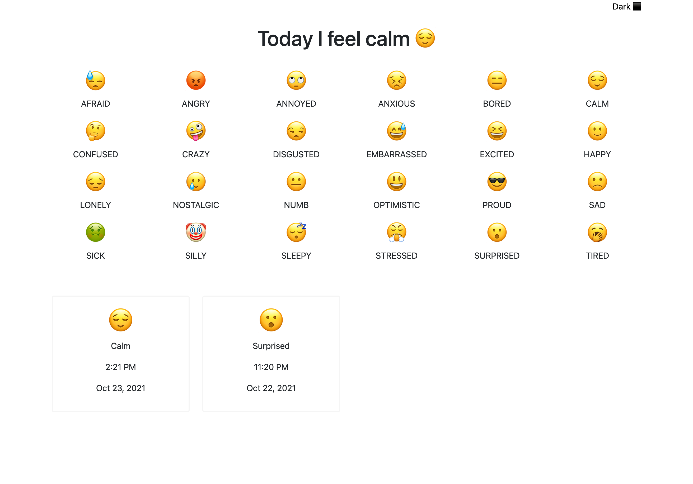

# Emoji Tracker

## Description

A mood tracking app using emojis. The app will let the user click on how they're feeling and store a record of each emoji.

This project is currently being refactored as a MERN stack application.

[🚀 https://emoji-tracker.onrender.com/](https://emoji-tracker.onrender.com/)

## Table of Contents

- [Image](#image)
- [Technologies](#technologies)
- [Known-Bugs](#known-bugs)
- [Next-Steps](#next-steps)
- [License](#license)
- [Contact](#contact)
- [Links](#links)

## Image

## Technologies

JavaScript
Express.js
Node.js
MongoDB
React.js
Render

## License

This project is licensed under the [MIT](https://opensource.org/licenses/MIT) license.

## Contact

Author: Ray Luna

If you have any questions about the repo, open an issue or contact me directly at:

- E-Mail: leon.luna.ray@gmail.com
- GitHub: [leon-luna-ray](https://github.com/leon-luna-ray)

## Links

- [Deployed Project](https://emoji-tracker.onrender.com/)

- [Project Repository](https://github.com/leon-luna-ray/emoji-tracker/)
