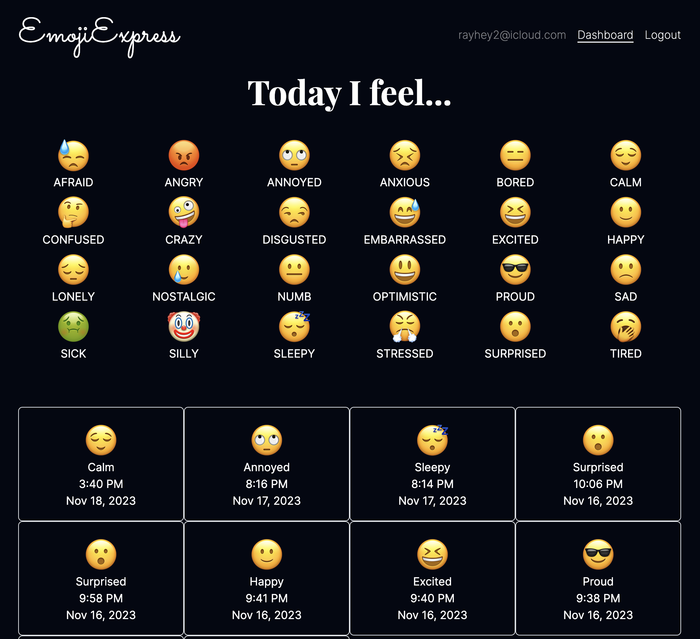

# Emoji Express

## Description

A mood tracking app using emojis. The app will let the user click on how they're feeling and store a record of each emoji.

This is a full-stack MERN application with user authentication. Users can create an account to store and view their posts from anywhere.

[🚀 https://emoji-express.fly.dev/](https://emoji-express.fly.dev/)

## Table of Contents

- [Image](#image)
- [Technologies](#technologies)
- [Known-Bugs](#known-bugs)
- [Next-Steps](#next-steps)
- [License](#license)
- [Contact](#contact)
- [Links](#links)

## Technologies

### Frontend
- JavaScript
- React.js
- CSS3
- HTML5
- Tailwind CSS
- Vite.js

### Backend
- Express.js
- Node.js
- Fly.io
- MongoDB

### Images

## License

This project is licensed under the [MIT](https://opensource.org/licenses/MIT) license.

## Contact

Author: Ray Luna

If you have any questions about the repo, open an issue or contact me directly at:

- E-Mail: leon.luna.ray@gmail.com
- GitHub: [leon-luna-ray](https://github.com/leon-luna-ray)

## Links

- [Deployed Project](https://emoji-express.fly.dev/)

- [Project Repository](https://github.com/leon-luna-ray/emoji-express/)
